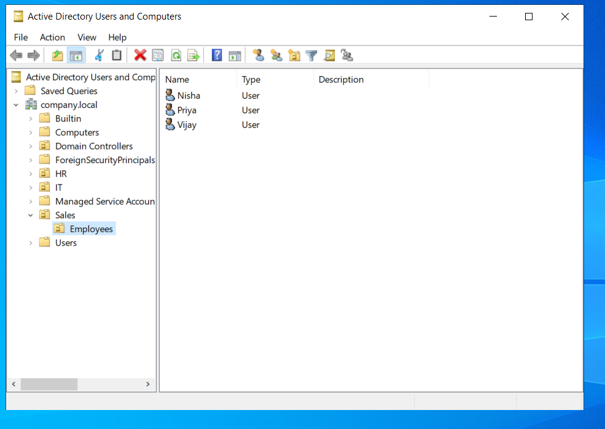
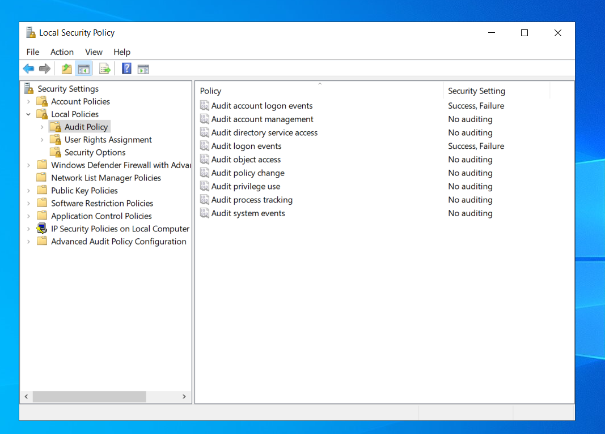
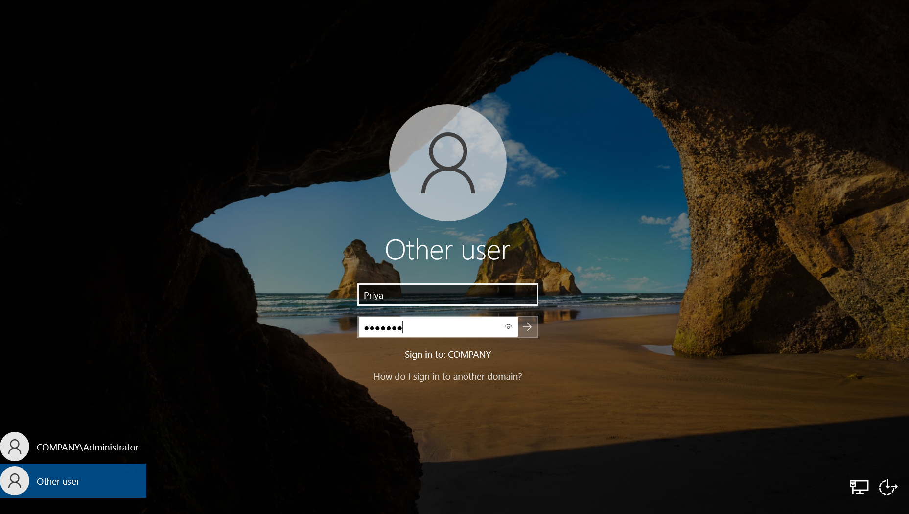
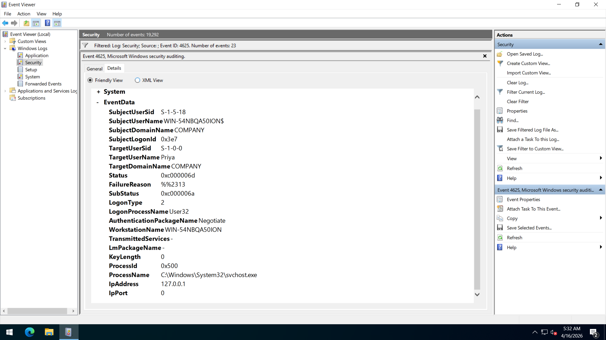
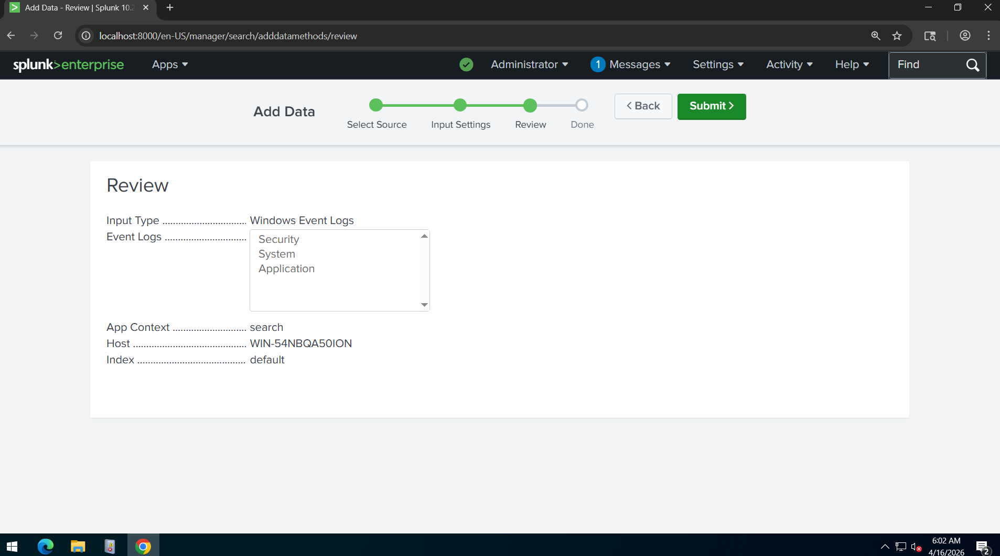
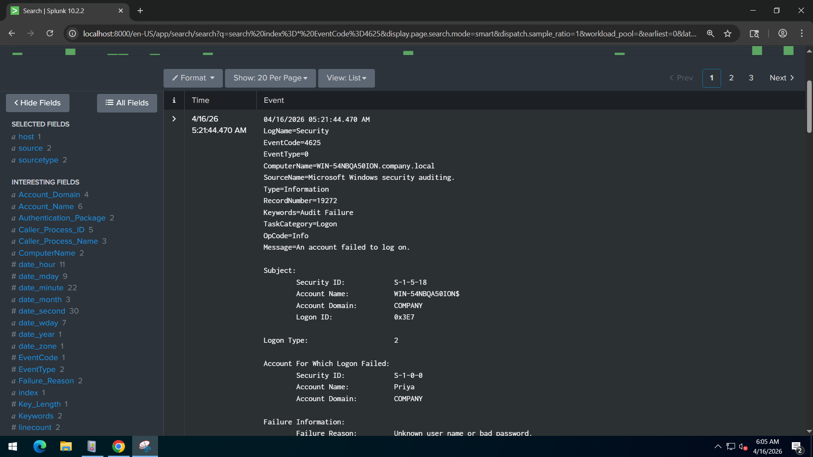
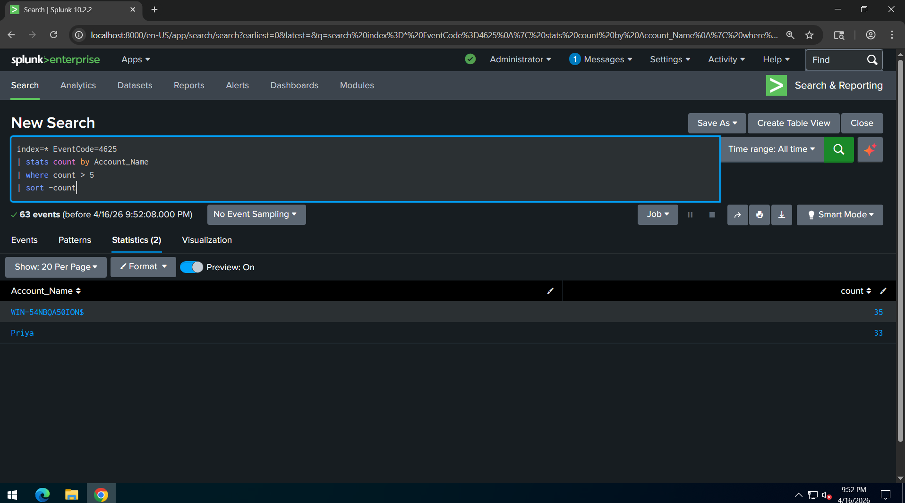

# SOC Detection Project: Brute-Force Attack (Active Directory + Splunk)

## Project Overview
This project demonstrates detection of brute-force login attempts in an Active Directory environment using Splunk SIEM.

The lab simulates real-world SOC monitoring by collecting Windows Security logs and identifying suspicious authentication activity.

---

## Technologies Used
- Windows Server 2022 (Active Directory)
- Splunk Enterprise
- Splunk Universal Forwarder
- Windows Event Logs

---

## Lab Setup

### Active Directory Users

- Created domain: company.local
- Created users: Nisha, Priya, Vijay
- Organized under Sales → Employees OU

---

### Audit Policy Configuration

Enabled:
- Audit logon events → Success, Failure
- Audit account logon events → Success, Failure

---

### Simulated Brute-Force Attack

- Attempted multiple failed logins using user Priya
- Incorrect password used repeatedly

---

### Event Viewer Logs (Event ID 4625)

- Event ID: 4625
- Description: Failed login attempt
- Failure reason: Bad username or password

---

### Splunk Data Ingestion

- Added Windows Event Logs (Security)
- Logs successfully ingested into Splunk

---

### Splunk Log Analysis

- Verified failed login events in Splunk
- Source: Windows Security Logs

---

### Detection Query

index=* EventCode=4625
| stats count by Account_Name
| where count > 5
| sort -count

---

## Detection Logic
- Monitors failed login attempts (Event ID 4625)
- Flags accounts with multiple failures
- Helps identify brute-force attacks

---

## Key Learnings
- Active Directory log management
- Windows Security Event analysis
- Splunk data ingestion and querying
- Brute-force attack detection

---

## Future Improvements
- Create real-time alerts in Splunk
- Add dashboard visualization
- Integrate with SOAR tools

